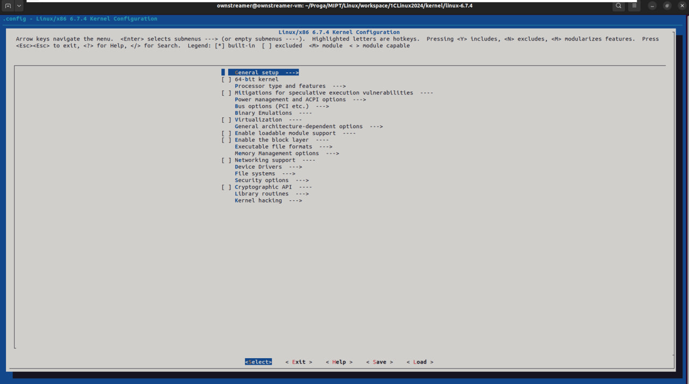

## Задачи на зачёт
[Ссылка на google documents](https://docs.google.com/document/d/1nhAlUEMkvF5_fIKIAgFUUdx5BREyQTs4YXZAkKnwmYw/edit?usp=sharing).

<!----------------------------------------------------------------------------->

## Материалы
- [Ссылка на google drive](https://drive.google.com/drive/folders/1QniB2VWMpEYQezUCnY9fn29_vP2YVIiU?usp=drive_link).
- Документация по тому, как устроено ядро: [docs.kernel.org](docs.kernel.org). Всегда лучше начинать поиск с этого сайта (там есть внутренний поиск)


<!----------------------------------------------------------------------------->

# Настройка рабочего окружения

## Установка зависимостей

Для виртуализации и установки ядра нужно установить зависимости ниже.
```bash
sudo apt-get update && sudo apt-get -y upgrade
sudo apt-get -y install build-essential \
                        libncurses-dev \
                        bison \
                        flex \
                        libssl-dev \
                        libelf-dev \
                        libelf-dev \
                        bc \
                        cpu-checker \
                        qemu-system-x86 \
                        aria2
```

<!----------------------------------------------------------------------------->

## Инструкция по установке ядра и `initramfs`

1) Найти исходники ядра можно на сайте [kernel.org](kernel.org). В курсе будем использовать версию ядра 6.7.4 ([ссылка для скачивания](https://cdn.kernel.org/pub/linux/kernel/v6.x/linux-6.7.4.tar.xz))

2) Создаём папку `kernel`, переходим туда и скачиваем исходники ядра. **ВАЖНО**: чтобы всё работало корректно, в пути до папки `kernel` не должно быть пробельных символов.
    ```bash
    wget https://cdn.kernel.org/pub/linux/kernel/v6.x/linux-6.7.4.tar.xz
    ```

3) Распаковываем.
    ```bash
    tar -xf linux-6.7.4.tar.xz
    ```

4) Переходим в папку `linux-6.7.4` и выполняем команду.
    ```bash
    cd linux-6.7.4
    make help
    ```
    Перед нами высветятся таргеты для сборки. Нас интересуют следующие:
    - `help` &mdash; посмотреть доступные таргеты для сборки 
    - `defconfig` &mdash; 
    - `tinyconfig` &mdash;
    - `menuconfig` &mdash;
    - `all` &mdash;
    - `vmlinux` &mdash; сборка ядра
    - `modules` &mdash; сборка модулей
    - `modules_install` &mdash; установить модули по пути `INSTALL_MOD_PATH`
    - `install` &mdash; установка ядра в директорию `INSTALL_PATH`

5) Для сборки ядра нам нужно сгенерировать файл `.config`, которого в папке сейчас нет. Есть готовые пресеты этого файла. Их можно сгенерировать, собрав цели `defconfig` или `tinyconfig`. Нам в курсе полностью достаточно `defconfig`. Если необходимо добавить дополнительные опции, можно воспользоваться целью `menuconfig`. Итого:
    ```bash
    make defconfig
    make menuconfig  # not needed
    ```
   Переходите к следующему пункту, если выполнили первую команду.

   Иначе при вызове `menuconfig` должно открыться окно:
   

   Небольшой ликбез по основным командам:
   - Поиск опций &mdash; `/`
   - Выбрать опцию &mdash; `Space`
   - Сохранить `.config` &mdash; стрелками выбираем `save`, затем 2 раза `Enter`
   - Выход аналогично
   
   Нам нужны следующие опции:
   - `64-bit kernel`
   - `Virtualization`
   - `Enable loadable module support`

6) Сохраняем конфиг и собираем ядро + модули.
   ```bash
   make -j$(($(nproc) + 1)) all
   ```
   Если следующая команда завершилась с ошибкой, попробуйте следующие действия:
   - Установите [зависимости](#установка-зависимостей).
   - Выполните команды (oни попросят ответа, когда начнется сборка ядра, тогда просто нажмите `Enter`)
   ```bash
   scripts/config --disable SYSTEM_TRUSTED_KEYS
   scripts/config --disable SYSTEM_REVOCATION_KEYS
   ```
   - Если прервали сборку (`ctrl+C`), то нужно выполнить `make clean` и попробовать собрать заново.

7) Теперь нужно получить бинари нашего ядра. Для этого в папке `linux-6.7.4`:
   ```bash
   mkdir -p ../boot
   INSTALL_PATH=../boot make install
   cd ../boot
   ls
   ```
   Должно получиться следующее:

   

   `boot` не должен лежать внутри `vroot`, так как он должен быть как бы отдельным разделом (как в обычной операционной системе, хотя некоторые системы также создают папку `boot`, но она всё равно не используется при работе операционной системы).

8) Устанавливаем модули ядра
   ```bash
   mkdir -p ../vroot/lib/modules
   
   cd ../linux-6.7.4
   INSTALL_MOD_PATH=<abs_path_to_kernel>/vroot/ make modules_install
   # example
   INSTALL_MOD_PATH=/home/ownstreamer/Proga/MIPT/Linux/workspace/kernel/vroot/ make modules_install
   ```

9) Если сейчас попробовать запустить ядро (без опции `-initrd`), получите следующее:
   
   Нам осталось сделать:
   - создать `vroot/init`
   - собрать `busybox`
   - собрать `initramfs`

<!----------------------------------------------------------------------------->

## Сборка `initramfs`

`initramfs` &mdash; виртуальная файловая система (архив с образом виртуальной файловой системы), расположенная в оперативной памяти. Сюда мы будем подкладывать наши модули и собирать ядро. Это удобно, так как сборка модуля ядра не требует пересборку самого ядра. `initramfs` это по сути архив.

Хороший гайд по установке `initramfs`: [wiki.gentoo.org](https://wiki.gentoo.org/wiki/Initramfs_-_make_your_own).

1) Создаём основные папки файловой системы.
   ```bash
   cd kernel
   mkdir vroot
   cd vroot
   mkdir sys bin lib dev root tmp proc
   touch init
   chmod +x init
   ```
   
2) В файл `init` вставляем:
   ```bash
   #!/bin/sh
   
   mount -t devtmpfs devtmpfs /dev
   mount -t tmpfs tmpfs /tmp
   mount -t proc proc /proc
   mount -t sysfs sysfs /sys
   
   echo 0 > /proc/sys/kernel/printk
   
   exec setsid sh -c 'exec sh </dev/ttyS0 >/dev/ttyS0 2>&1'
   ```

3) Базовый набор утилит возьмём из `busybox`. Переходим на сайт [busybox.net](busybox.net) в раздел `Download Source`. Скачиваем последнюю версию в папку `kernel`. В текущем гайде это версия `1.36.1`. И здесь же его распаковываем.
   ```bash
   cd kernel
   wget https://busybox.net/downloads/busybox-1.36.1.tar.bz2
   tar -xf busybox-1.36.1.tar.bz2
   ```
   
4) Далее делаем похожие действия, как делали при установке ядра.
   ```bash
   cd busybox-1.36.1/
   make help
   make defconfig
   make menuconfig # на этот раз это обязательно
   ```
   Нам нужны следующие опции:
   - Переходим `Settings` -> `Destination path for make install`. Заменяем `_install` на `../busybox`.
   - `Settings` -> `Build static binary (no shared libs)`

5) Установка `busybox`.
   ```bash
   make -j$(($(nproc) + 1)) all
   mkdir ../busybox
   make install
   ```
   Если что-то сделали не так, то нужно сделать слудующее:
   ```bash
   make uninstall
   make -j9 clean all install # 9 --- $(nproc) + 1
   ```
   
6) Устанавливаем утилиты из `busybox` в `vroot`.
   ```bash
   cd ../vroot
   ../busybox/bin/busybox --install ./bin
   ```

7) Устанавливаем `initramfs` из папки `vroot`.
   ```bash
   cd vroot
   find . | cpio -ov --format=newc | gzip -9 > ../initramfs
   ```
  `cpio` &mdash; контейнер (аналог `tar`-а). Вся файловая система кладётся в контейнер `cpio` и сжимается нужным нам алгоритмом сжатия.

<!----------------------------------------------------------------------------->

## Запуск ядра

- Если на хосте linux:
   ```bash
   cd kernel
   qemu-system-x86_64 -kernel ./boot/vmlinuz-6.7.4 -initrd initramfs --enable-kvm -cpu host -nographic -append "console=ttyS0"
   ```
- Если сидите с виртуалки (нет `nesting virtualization`):
   ```bash
   cd kernel
   qemu-system-x86_64 -kernel ./boot/vmlinuz-6.7.4 -initrd initramfs -nographic -append "console=ttyS0"
   ```

<!----------------------------------------------------------------------------->

## Остановка ядра
```bash
killall qemu-system-x86_64
```

<!----------------------------------------------------------------------------->

## Автоматическая сборка ядра (пока не работает стабильно)
1) Создаёте директорию `kernel`
2) Копируете туда файл `scripts/create_kernel.sh`
3) Запускаете команду
   ```bash
   ./create_kernel.sh --all
   ```
